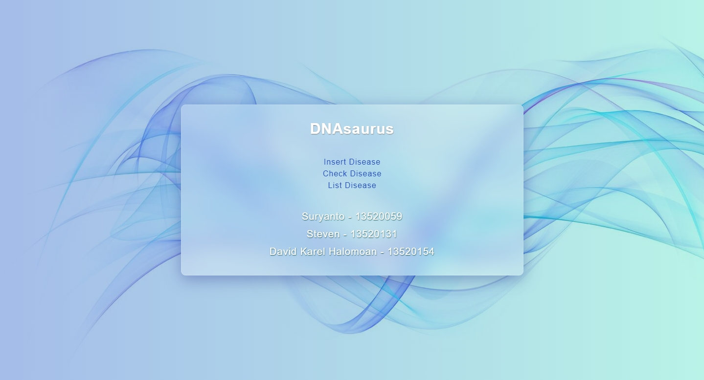
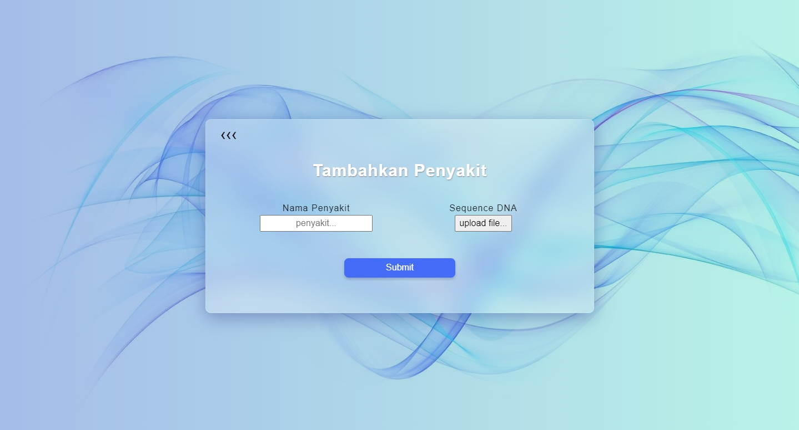
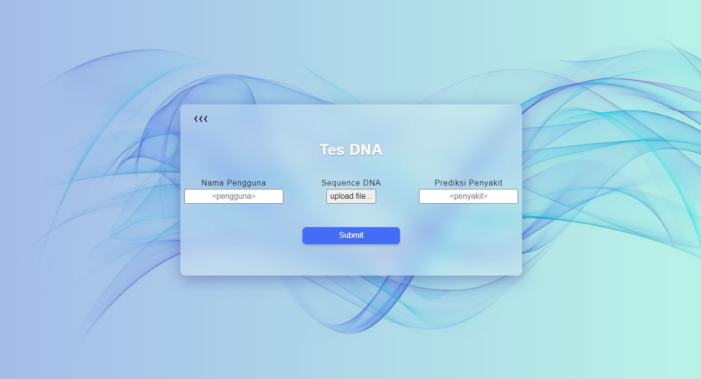
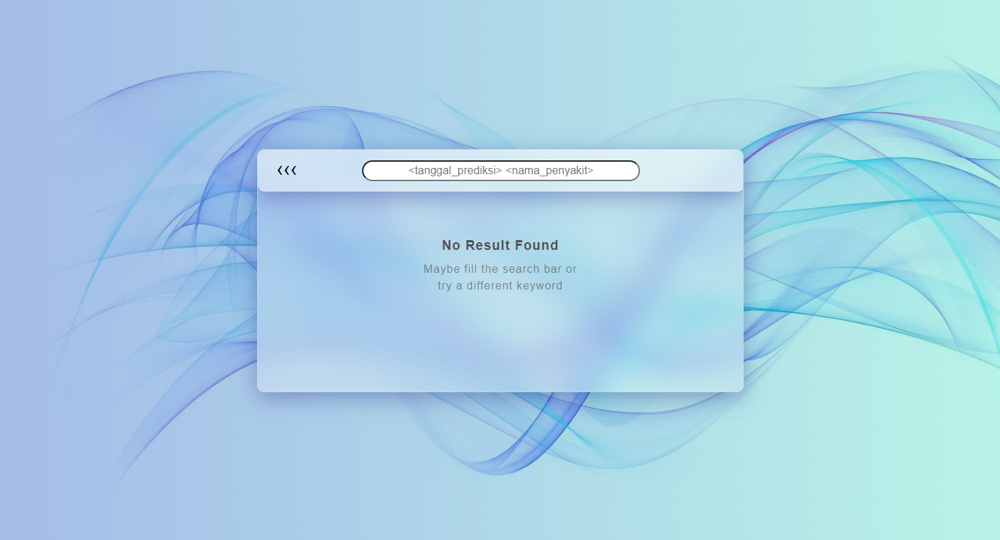

# Tugas Besar 3 IF2211 Strategi Algoritma

> Membangun sebuah aplikasi <em>DNA Pattern Matching</em> dengan memanfaatkan algoritma <em>String Matching</em> dan <em>Rgular Expression</em> yang di mana aplikasi ini dapat mendeteksi apakah seorang pasien mempunyai genetik tertentu dengan mencocokkan rantai DNA pasien dengan rantai DNA penyakit.

## Daftar Anggota Kelompok

<table>

<tr><td colspan = 3 align = "center">KELOMPOK 07 BreatheFirstBreadthLater</td></tr>
<tr><td>No.</td><td>Nama</td><td>NIM</td></tr>
<tr><td>1.</td><td>Suryanto</td><td>13520059</td></tr>
<tr><td>2.</td><td>Steven</td><td>13520131</td></tr>
<tr><td>3.</td><td>David Karel Halomoan</td><td>13520154</td></tr>

</table>

## Teknologi dan Library yang Digunakan

-   Vue.js
    -   Babel
    -   Eslint
    -   Vue Router
    -   Vuex
-   Axios
-   Bootstrap
-   connect-history-api-fallback
-   dotenv
-   Express.js
-   MongoDB
-   Nodemon
-   npm
-   Node.js
-   HTML
-   CSS
-   JS
-   Heroku

## Production Repository

```bash
https://github.com/loopfree/DNAsaurus
```

## Cara Memakai

<strong><ins>NOTE:</ins></strong> Untuk pemakaian local, perlu diminta `.env` kepada [loopfree](https://github.com/loopfree) atau meminta via [issues](https://github.com/SurTan02/Tubes3_13520059/issues)

### Via Browser

1. Buka browser <strong><em>Chromium Based</em></strong>

2. Ketikkan
    ```bash
    https://dnasaurus.herokuapp.com/
    ```

### Via Local (1)

<strong>NOTE:</strong> Back-End Serve Front-End

1. Download/Clone Repository ini

2. Jalankan Terminal

3. Masuk ke dalam directory src

4. Lakukan Penginstallan Dependencies

    ```bash
    npm install
    ```

5. Jalankan

    ```bash
    npm run build
    ```

6. Jalankan
    ```bash
    npm run test
    ```
7. Pada browser <strong><em>Chromium Based</em></strong> Ketikkan
    ```bash
    http://localhost:8000/
    ```
    <strong>Pastikan tidak ada yang sedang berjalan pada port 8000</strong>

### Via Local (2)

<strong>NOTE:</strong> Back End Hanya Rest API, Front End Pakai Vue Untuk Serve

1. Download/Clone Repository ini

2. Jalankan Terminal

3. Masuk ke dalam directory src

4. Lakukan Penginstallan Dependencies

    ```bash
    npm install
    ```

5. Jalankan

    ```bash
    npm run serve
    ```

6. Jalankan Pada Terminal Yang Berbeda

    ```bash
    npm run test
    ```

7. Pada browser <strong><em>Chromium Based</em></strong> Ketikkan
    ```bash
    http://localhost:8080/
    ```
    <strong>Pastikan tidak ada yang sedang berjalan pada port 8000</strong>

## Tampilan GUI Aplikasi DNAsaurus

### Home Page



### Insert Disease Page



### Check Disease Page



### List Disease Page



## Ucapan Terima Kasih

Atas bimbingan dan kesempatannya, kami mengucapkan terima kasih kepada

-   Dr. Masayu Leylia Khodra (Dosen K1 IF2211 Tahun 2021/2022)
-   Dr. Nur Ulfa Maulidevi (Dosen K2 IF2211 Tahun 2021/2022)
-   Dr. Rinaldi Munir (Dosen K3 IF2211 Tahun 2021/2022)
-   Semua Asisten IF2211 Tahun 2021/2022
